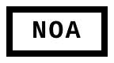

The NOA tag represents a commitment to preserving the integrity of software development by keeping projects free of political, cultural, or personal biases.

**NOA Manifesto**

**Neutral, Objective, Apolitical (NOA)**

The NOA tag represents a commitment to preserving the integrity of software development by keeping projects free of political, cultural, or personal biases. Similar to the FOSS tag, NOA establishes principles for creating and maintaining projects that focus purely on technical excellence, transparency, and inclusivity in the truest sense—free from any form of ideological influence. This manifesto outlines the core values and expectations of NOA-tagged projects.

### **Core Principles of NOA**

1. **Neutrality**
   - Projects must remain apolitical, avoiding involvement or alignment with any political ideologies, cultural movements, or personal beliefs.
   - Contributions to the project are judged solely on their technical merit, not the identity, beliefs, or affiliations of the contributor.

2. **Objectivity**
   - Development decisions must be guided by logic, technical needs, and practical considerations, ensuring unbiased and well-reasoned outcomes.
   - Features and updates should prioritize user functionality, efficiency, and innovation without pandering to external agendas.

3. **Transparency**
   - All funding sources must be disclosed publicly, including the amount and any associated conditions or restrictions.
   - Financial transparency ensures no covert influence compromises the NOA principles. Big corporate funding is discouraged to prevent external pressures that could dilute or manipulate the project’s direction.

4. **Apolitical Stance**
   - The project’s focus remains strictly on software development and technical progress. Social, cultural, or ideological narratives have no place in the project’s goals or communication.
   - Respect for contributors’ diverse backgrounds and beliefs is ensured by maintaining an environment where personal ideologies are irrelevant to the project.

5. **Non-Corporate Influence**
   - NOA projects reject funding, sponsorship, or partnerships that could compromise their independence. Financial contributions must be free of conditions that conflict with NOA values.
   - The goal is to avoid the "embrace, extend, and extinguish" tactics often used by corporations to dominate and undermine independent projects.

### **Commitments of NOA-Tagged Projects**

- **Focus on Technical Excellence:** Development efforts remain centered on creating efficient, reliable, and innovative software solutions.
- **Non-Discrimination:** Every aspect of the project—from code contributions to user accessibility—is free from discrimination in any form.
- **Rejection of "Woke" and Biased Agendas:** Projects are shielded from trends or movements that attempt to force ideological compliance at the expense of technical quality or project focus.
- **Sustainability Through Transparency:** Financial and operational details are open for public scrutiny, ensuring accountability and trustworthiness.

### **Preventing Corruption of NOA Values**

1. **Community Governance**
   - Decision-making processes should involve the community to avoid centralization of power that could be manipulated.
   - Clear guidelines and policies must be in place to ensure adherence to NOA principles.

2. **Strict Financial Guidelines**
   - Donations and funding must be publicly documented, with full transparency about terms and conditions.
   - Any attempt to impose restrictions that conflict with NOA principles must be rejected.

3. **Independent Audits**
   - Regular audits of finances and decision-making processes can help ensure continued compliance with NOA values.

4. **Resilience Against External Pressure**
   - Develop strategies to resist corporate or ideological pressure, such as relying on distributed and community-based funding sources.
   - Use decentralized communication platforms to avoid external censorship or influence.

### **The Path Forward**

NOA is more than a tag; it’s a movement to restore focus, integrity, and neutrality to software development. By adopting the NOA tag, projects declare their commitment to technical excellence, transparency, and independence, free from ideological or corporate corruption. Together, we can create software that serves everyone equally, driven by innovation and purpose—not agendas.

**Join the NOA Movement**
Let’s ensure that software remains a tool for progress, not propaganda. Declare your commitment to NOA values and help build a future where great software stands untainted and truly free.

